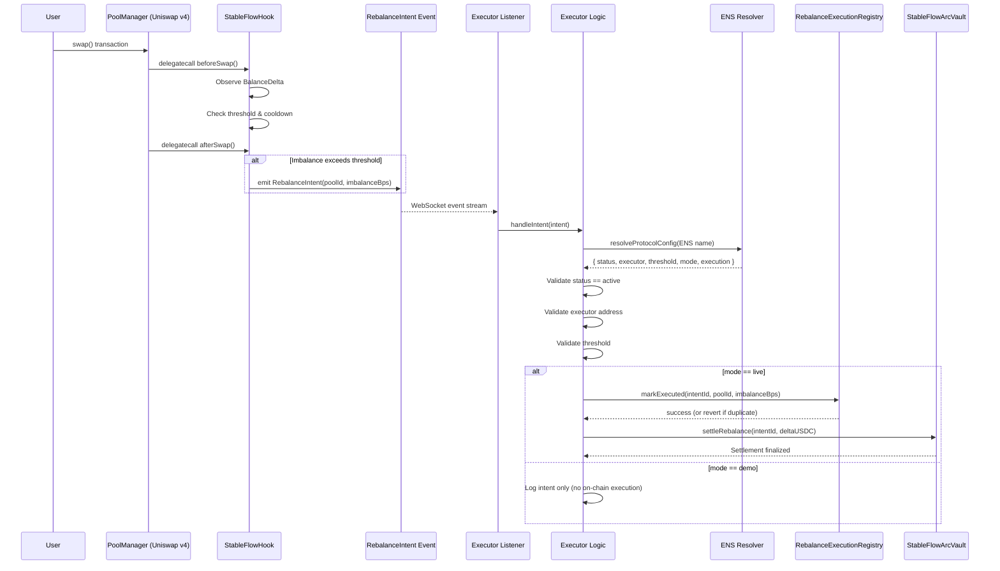
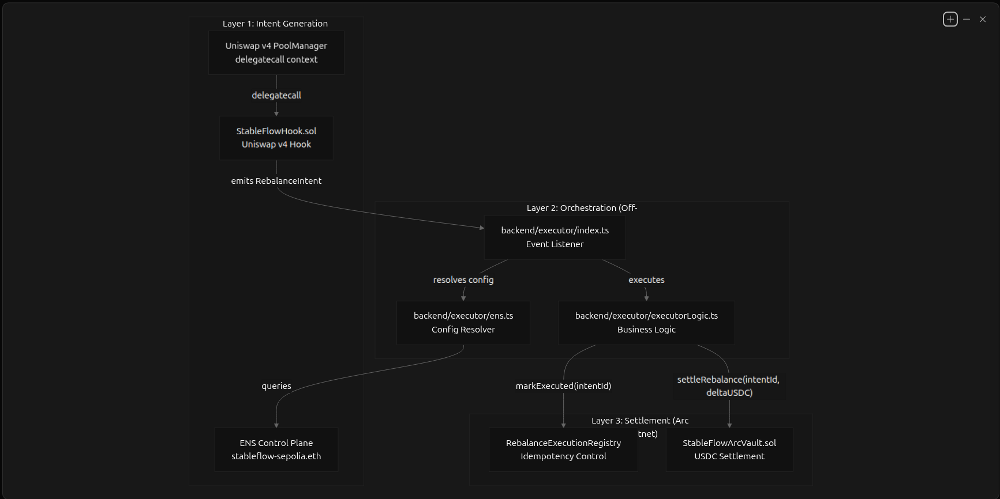
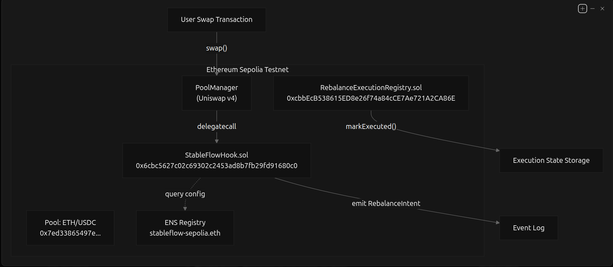
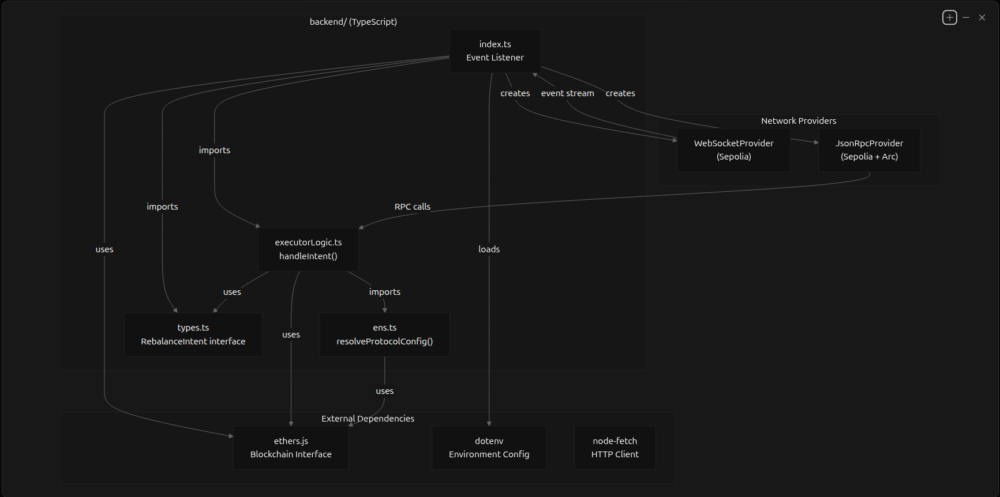

# StableFlow 🚀

**Status:** Completed MVP (ETHGlobal HackMoney)

StableFlow is an **intent-based, cross-chain stablecoin rebalancing system** built around **Uniswap v4 hooks**, with **ENS-governed execution**, **idempotent execution guarantees**, and **Arc-based settlement**.

The protocol follows a strict safety invariant:

> **Hooks generate intent. Execution happens elsewhere.**

Each layer is deliberately isolated to preserve safety, determinism, and verifiability.

---

## Current Progress

### Phase 1–3: Uniswap v4 Hook (COMPLETED)

The core Uniswap v4 hook is fully implemented, deployed, and exercised on-chain.

#### Implemented functionality

* Dynamic fee adjustment based on observed swap flow
* Imbalance detection using `BalanceDelta` (flow-based heuristic)
* Time-windowed aggregation of swap pressure
* Threshold-gated rebalancing intent emission
* Cooldown-enforced intent rate limiting
* Explicit caps on imbalance magnitude
* **Strict Uniswap v4 hook safety**

  * no external calls
  * deterministic execution
  * bounded storage per pool

Core file:

```
contracts/hooks/StableFlowHook.sol
```

---

## On-chain Verification (Ethereum Sepolia)

**StableFlowHook:**
[https://sepolia.etherscan.io/address/0x6cbc5627c02c69302c2453ad8b7fb29fd91680c0](https://sepolia.etherscan.io/address/0x6cbc5627c02c69302c2453ad8b7fb29fd91680c0)

### Active Pool

Currently exercised against **one Uniswap v4 pool**:

* **Pair:** ETH / USDC (Sepolia)
* **PoolId:**

```
0x7ed33865497eadd088abeb177a5b9d3e4976ead35f6c103b9679a53ad6971ae2
```

Hooks execute via `delegatecall` from `PoolManager` and do not appear as standalone transactions, as expected in Uniswap v4.

---

## Why There Is No TWAP or Oracle Logic

Uniswap v4 does not expose a standalone oracle like Uniswap v3, and hooks are not designed to compute price-based TWAPs.

StableFlow instead uses a **v4-native heuristic**:

* Net swap flow via `BalanceDelta`
* Time-windowed aggregation
* Noise thresholds
* Cooldowns to prevent rapid retriggering
* Hard caps to bound behavior

The hook **does not infer price**.
It observes **persistent liquidity pressure**, which is sufficient to generate a **safe intent**, not an execution.

---

## ENS Control Plane (COMPLETED)

StableFlow uses **ENS as a live protocol control plane**.

ENS governs executor behavior and protocol configuration without redeployment.

### ENS name

```
stableflow-sepolia.eth
```

### ENS-controlled parameters

Stored as ENS text records:

* `stableflow:hook` → canonical hook address
* `stableflow:threshold:bps` → intent emission threshold
* `stableflow:status` → active / paused
* `stableflow:execution` → execution enabled / disabled
* `stableflow:mode` → `demo` vs `live`
* `stableflow:chain` → target execution chain
* `stableflow:executor` → authorized executor address

Executors **resolve ENS on every intent**, making configuration transparent, auditable, and hot-swappable.

---

## RebalanceExecutionRegistry (COMPLETED)

To ensure **safe, idempotent execution**, StableFlow introduces an on-chain execution registry.

### RebalanceExecutionRegistry (Sepolia)

**Deployed at:**
[https://sepolia.etherscan.io/address/0xcbbEcB538615ED8e26f74a84cCE7Ae721A2CA86E](https://sepolia.etherscan.io/address/0xcbbEcB538615ED8e26f74a84cCE7Ae721A2CA86E)

### Why this contract exists

Uniswap v4 hooks emit **events**, not transactions.
Off-chain executors are **permissionless** and **may retry** execution.

Without a registry:

* The same intent could be executed multiple times
* Executors could race
* Settlement safety would be compromised

### What the registry guarantees

* Each intent is uniquely identified (`intentId`)
* Execution is **recorded on-chain**
* Duplicate execution attempts revert
* Execution becomes **idempotent by construction**

### How it is used

1. Executor computes a deterministic `intentId`
2. Executor calls `markExecuted(intentId, poolId, imbalanceBps)`
3. If already executed → transaction reverts
4. If successful → executor proceeds to settlement (Arc)

This contract is intentionally minimal and chain-agnostic.

---

## Arc Settlement Layer (COMPLETED)

StableFlow uses **Arc** as its **liquidity hub and settlement layer**.

### StableFlowArcVault

**Deployed on Arc Testnet:**
[https://testnet.arcscan.app/address/0x5618F6541328ca1FdCf1838f1Bc4d3D14558E29f](https://testnet.arcscan.app/address/0x5618F6541328ca1FdCf1838f1Bc4d3D14558E29f)

The Arc vault:

* Holds USDC on Arc (native gas)
* Receives finalized settlements from the executor
* Acts as the canonical accounting endpoint

Core file:

```
contracts/arc/StableFlowArcVault.sol
```

### What is proven

* Execution is governed by ENS
* Idempotency is enforced on Ethereum
* Settlement is finalized independently on Arc
* Ethereum and Arc concerns remain cleanly separated

---

## Intent Execution Pipeline (COMPLETED)

End-to-end flow:

1. Swap occurs on Uniswap v4 (Sepolia)
2. Hook emits `RebalanceIntent`
3. Off-chain executor listens
4. ENS configuration is resolved
5. Executor authorization is verified
6. Intent is marked executed in `RebalanceExecutionRegistry`
7. Settlement is finalized on Arc via `StableFlowArcVault`

All steps are verifiable via on-chain transactions.

---

## Vault Note (ERC-4626)

A minimal ERC-4626 vault exists as a **reference implementation**:

```
contracts/vault/StableFlowVault.sol
```

It is **not used** in the active execution path.

The live settlement layer is **StableFlowArcVault** on Arc.

---

## Networks

Validated on:

* Ethereum Sepolia
* Uniswap v4 PoolManager (Sepolia)
* Arc Testnet (USDC-native gas)

---

## Note for Reviewers and Judges

Recommended review order:

1. `StableFlowHook.sol`
2. Flow-based intent logic
3. ENS-governed execution controls
4. `RebalanceExecutionRegistry` (idempotency)
5. Executor → Arc settlement flow
6. Arc `settleRebalance` transactions

Each component is intentionally minimal and independently verifiable.

---

*The flow stabilizes — one intent at a time.*

---


## 🔄 How It Works (End-to-End Flow)



## Component Execution Summary:



---

## Intent Generation Layer (Sepolia)
### Overview

The intent generation layer operates within Uniswap v4's execution context on Ethereum Sepolia. It consists of a hook contract that monitors swap activity and emits structured intent events when rebalancing conditions are met.



---
## Off-Chain Execution Layer
## Overview

The off-chain execution layer is a Node.js/TypeScript service that orchestrates intent processing. It listens for RebalanceIntent events, validates execution authority, and coordinates the two-phase commit across chains.


---

## 🧭 Step-by-Step Explanation

1. **Swap Execution**
   A user performs a swap on a Uniswap v4 pool.

2. **Hook Observation (No External Calls)**
   `StableFlowHook` runs via `delegatecall`, observes net swap flow using `BalanceDelta`, and applies safety checks.

3. **Intent Emission**
   If imbalance exceeds the ENS-configured threshold, the hook emits a `RebalanceIntent` event — *no execution occurs on-chain*.

4. **Permissionless Event Listening**
   Off-chain executors subscribe to intent events via WebSocket.

5. **ENS-Governed Control Plane**
   The executor resolves `stableflow-sepolia.eth` on every intent to fetch:

   * protocol status
   * authorized executor
   * execution mode
   * thresholds

6. **Execution Validation**
   Executor verifies:

   * protocol is active
   * executor is authorized
   * intent exceeds threshold

7. **Idempotent Execution (Live Mode)**

   * Intent is first recorded in `RebalanceExecutionRegistry`
   * Duplicate executions revert by construction

8. **Cross-Chain Settlement**
   After registry success, settlement is finalized on Arc via `StableFlowArcVault`.

9. **Demo Mode (No Execution)**
   If ENS mode is `demo`, execution is skipped and only logged: same intent path, zero side effects.

---


---
## 📦 Repository Structure

```
StableFlow/
├── contracts/                         # Smart contracts (Solidity / Foundry)
│   ├── src/
│   │   ├── hooks/                     # Uniswap v4 hook logic
│   │   │   └── StableFlowHook.sol     # Emits rebalancing intents (no execution)
│   │   │
│   │   ├── execution/                 # Execution safety layer
│   │   │   └── RebalanceExecutionRegistry.sol
│   │   │                                # On-chain idempotency & replay protection
│   │   │
│   │   ├── arc/                       # Arc settlement layer
│   │   │   └── StableFlowArcVault.sol # USDC-native vault on Arc
│   │   │
│   │   ├── vault/                     # Reference ERC-4626 vault (not in live path)
│   │   │   └── StableFlowVault.sol
│   │   │
│   │   ├── interfaces/                # Shared interfaces
│   │   └── libraries/                 # SafeCast, helpers, utilities
│   │
│   ├── script/                        # Deployment & interaction scripts
│   │   ├── 00_DeployHook.s.sol
│   │   ├── 01_CreatePoolAndAddLiquidity.s.sol
│   │   ├── 03_Swap.s.sol              # Triggers hook + intent emission
│   │   └── DeployStableFlowArcVault.s.sol
│   │
│   ├── test/                          # Foundry tests
│   │   ├── hooks/                     # Hook safety & intent tests
│   │   ├── execution/                 # Registry idempotency tests
│   │   └── arc/                       # Arc vault settlement tests
│   │
│   ├── foundry.toml
│   └── README.md                      # Smart contract documentation
│
├── backend/                           # Off-chain executor (Node.js / TypeScript)
│   ├── executor/
│   │   ├── index.ts                   # Executor entry point (event listener)
│   │   ├── executorLogic.ts           # ENS-gated execution + Arc settlement
│   │   ├── ens.ts                     # ENS resolution (control plane)
│   │   └── types.ts                   # Intent & config types
│   │
│   ├── package.json
│   └── tsconfig.json
│
├── frontend/                          # Monitoring & verification UI (Next.js)
│   ├── app/
│   │   └── page.tsx                   # Main dashboard
│   │
│   ├── components/
│   │   ├── ENSConfiguration.tsx       # ENS control plane visualization
│   │   ├── ArcVaultStatus.tsx         # Arc USDC vault balance
│   │   ├── IntentFeed.tsx             # Intent → execution → settlement trace
│   │   ├── NetworkIndicator.tsx       # Sepolia + Arc status
│   │   └── Card.tsx                   # UI wrapper
│   │
│   ├── lib/
│   │   ├── ens.ts                     # ENS read helpers
│   │   └── arc.ts                     # Arc RPC helpers
│   │
│   ├── public/
│   ├── next.config.ts
│   └── README.md                      # Frontend overview
│
├── README.md                          # Main project README (architecture & flow)
└── package.json                       # Workspace dependencies
```

---


## 🚀 Quick Start (Development)

This guide walks through running **StableFlow end-to-end**:
**Uniswap v4 Hook → ENS Control Plane → Executor → Arc Settlement → Frontend**

---

## Prerequisites

* **Node.js 18+** and npm
* **Foundry** (`forge`, `cast`)
* **Ethereum wallet** with Sepolia ETH
* **Arc Testnet access**
* RPC providers:

  * Ethereum Sepolia (Alchemy / Infura)
  * Arc Testnet RPC

---

## 1️⃣ Deploy Smart Contracts (Sepolia + Arc)

### Install dependencies

```bash
cd contracts
forge install
cp .env.example .env
```

### Required `.env`
```env
SEPOLIA_RPC_URL=
ARC_RPC_URL=
EXECUTION_REGISTRY_ADDRESS=
EXECUTOR_PRIVATE_KEY=
EXECUTOR_ADDRESS=


ETHERSCAN_API_KEY=

# ARC
ARC_API_KEY=
STABLEFLOWVAULT_DEPLOYED_ADDRESS=
ARC_CHAIN_ID=
ARC_USDC_ADDRESS=0x3600000000000000000000000000000000000000
```

### Deploy StableFlow Hook (Sepolia)

```bash
forge script script/00_DeployHook.s.sol \
  --rpc-url <SEPOLIA_RPC> \
  --broadcast \
  --verify
```

### Create Pool & Add Liquidity

```bash
forge script script/01_CreatePoolAndAddLiquidity.s.sol \
  --rpc-url <SEPOLIA_RPC> \
  --broadcast
```

### Deploy Execution Registry (Sepolia)

```bash
forge script script/DeployStableFlowExecutionRegistry.s.sol \
  --rpc-url <SEPOLIA_RPC> \
  --broadcast
```

### Deploy Arc Vault (Arc Testnet)

```bash
forge script script/DeployStableFlowArcVault.s.sol \
  --rpc-url <ARC_RPC> \
  --broadcast
```

This creates:

* `StableFlowHook` (Uniswap v4 hook)
* `RebalanceExecutionRegistry` (idempotency layer)
* `StableFlowArcVault` (Arc settlement vault)

---

## 2️⃣ Configure ENS Control Plane (Critical)

StableFlow is governed via ENS text records.

### ENS Name

```
stableflow-sepolia.eth
```

### Required ENS text records

Set these via **ENS App → Text Records**:

```text
stableflow:hook = <StableFlowHook address>
stableflow:threshold:bps = 10
stableflow:status = active
stableflow:execution = enabled
stableflow:mode = live
stableflow:chain = arc
stableflow:executor = <executor EOA>
```

> ⚠️ Executors **resolve ENS on every intent** — no redeploys required.

---

## 3️⃣ Start Backend Executor

The executor listens for intents and performs execution + settlement.

### Install & configure

```bash
cd backend/executor
npm install
cp .env.example .env
```

### Required `.env`

```env
WS_RPC_URL=
RPC_URL=
ARC_RPC_URL=
HOOK_ADDRESS=
PROTOCOL_ENS_NAME=
EXECUTION_REGISTRY_ADDRESS=
EXECUTOR_PRIVATE_KEY=

ARC_VAULT_ADDRESS=
```

### Start executor

```bash
npx ts-node index.ts
```

Expected logs:

```
🟢 StableFlow Executor running
Listening for RebalanceIntent...
```
ℹ️ The executor runs continuously and reacts to intents as they are emitted on-chain.

---

## 4️⃣ Run Frontend Dashboard

The frontend is **read-only**, fully derived from on-chain + ENS state.

### Install & run

```bash
cd frontend
npm install
npm run dev
cp .env.local.example .env.local
```

### Required `.env.local`

```env
# --- Ethereum Sepolia (ENS) ---
NEXT_PUBLIC_ETH_RPC="
NEXT_PUBLIC_PROTOCOL_ENS=

# --- Arc Testnet ---
NEXT_PUBLIC_ARC_RPC=
NEXT_PUBLIC_ARC_CHAIN_ID=5042002

# --- Arc Contracts ---
NEXT_PUBLIC_ARC_VAULT=
NEXT_PUBLIC_USDC_ARC=0x3600000000000000000000000000000000000000

# --- Sepolia Contracts ---
NEXT_PUBLIC_HOOK_ADDRESS=
NEXT_PUBLIC_EXECUTION_REGISTRY=
```

Open:

```
http://localhost:3000
```

Frontend displays:

* ENS-controlled protocol status
* Arc vault USDC balance
* Real-time intent execution trace
* Network health indicators

---

## 5️⃣ Trigger a Rebalance (End-to-End Test)

### Execute a swap on the Uniswap v4 pool (Sepolia)

```bash
forge script script/03_Swap.s.sol \
  --rpc-url <SEPOLIA_RPC> \
  --broadcast
```

### Observe:

**Backend**

```
🔔 Rebalance Intent Detected
🟢 Live mode - Executing Intent
✅ Execution finalized on-chain
```

**On-chain**

* `RebalanceExecutionRegistry.markExecuted()` tx (Sepolia)
* `StableFlowArcVault.settleRebalance()` tx (Arc)

**Frontend**

* Intent execution trace updates
* Arc vault balance reflects settlement

---

## 🧪 Demo Mode Test (Execution Pause)

To demonstrate governance control:

1. Change ENS:

   ```text
   stableflow:status = inactive
   ```
2. Trigger another swap

Result:

* Hook still emits intent
* Executor **halts execution**
* No registry write
* No Arc settlement

This proves **ENS-governed execution control**.

---


## ✅ Expected Guarantees

* Hooks never execute external calls
* Execution is permissionless but controlled
* Duplicate intent execution is impossible
* Governance is live and transparent
* Ethereum ↔ Arc responsibilities are isolated

